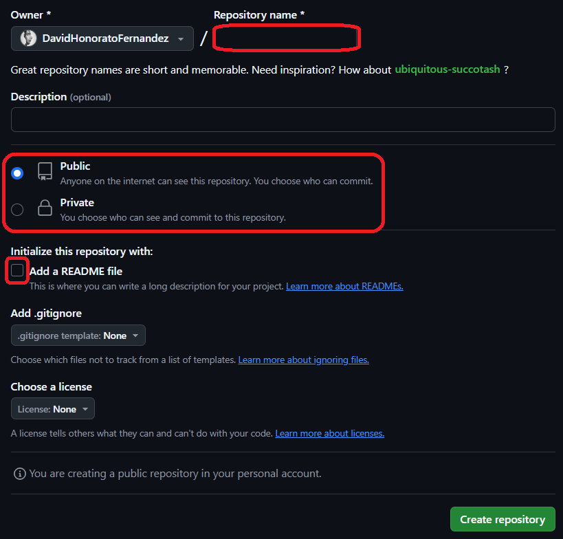

# Apuntes-HTML

## Indice

[Aprendizaje GitHub](#aprendizaje-github)

[Aprendizaje MarkDown](#aprendizaje-markdown)

[Aprendizaje HTML](#aprendizaje-html)

[Aprendizaje CSS](#aprendizaje-css)

<hr>

## Aprendizaje Github

Para empezar con GitHub, primero tenemos que conocer como podemos acceder a los repositorios, para ello, tenemos que dirigirnos a nuestro perfil, ubicado en la esquina superior derecha, en caso de no tener uno, lo creamos indicando nuestros datos:


En el que se nos desplegará un panel lateral, donde indica las acciones que podemos hacer, seleccionaremos "Your repositories":


A continuación veremos la sección de nuestros repositorios, pero como nosotros es crear uno, ignoraremos todos los repositorios e iremos al apartado "New", el cual se encuentra con un botón verde en la esquina superior derecha:


Finalmente, estaremos en la sección de la creación del repositorio, en la que nos centraremos en tres zonas:

La primera, es el nombre del repositorio, que es básicamente el nombre que tendrá el repositorio donde estará todo lo que creemos después.

La segunda, es si queremos que el repositorio sea público o privado, en caso de ser público, está 100% accesible para cualquier usuario, la otra opción es privada, y, al contrario, solo nosotros decidiremos quien puede acceder.

Y por último, el archivo readme, que en este caso, es el archivo donde podremos ver el contenido en github sin necesidad de un archivo externo.




### Comandos CMD Git

**Git init:** Para crear o reiniciar el repositorio en local.

**Git Branch:** Indica si el repositorio está en la rama “main”.

**Git Branch -M main:** Se utiliza en caso de que la rama no esté en la “main”.

**Git add README.md:** Sirve para solamente subir un archivo en específico al commit.

**Git add .:** Sirve para subir todos los archivos de la carpeta al commit.

**Git commit:** Sirve para preparar el commit.

**Git commit -m “mensaje":** Sirve para indicar un título/nombre a ese commit.

**Git push origin main:** Sirve para subir el commit. (Origin -> Origen) (Main-> Destino).

**Git clone "URL":** Clona el repositorio a local.

**Git remote add origin "link/url"** Crea un sitio origen en la url del repositorio de github.

**Git pull:** Coordina la versión de arriba (GitHub) con la local.

[Volver al Indice](#indice)

<hr>

## Aprendizaje MarkDown

Para empezar con Markdown, debemos saber como hacer encabezados, pero, antes de ello, tenemos que saber que hay diferentes niveles de encabezado, empezando por el primer al sexto nivel, para indicar dicho encabezado, tendremos que utilizar el "#", el nivel del encabezado depende del número de "#" que indiques, a continuación te dejo una explicación gráfica:

``# Primer nivel de encabezado``
<br>
``## Segundo nivel de encabezado``
<br>
``### Tercero nivel de encabezado``
<br>
``#### Cuarto nivel de encabezado``
<br>
``##### Quinto nivel de encabezado``
<br>
``###### Sexto nivel de encabezado``


### Formato de letras

Markdown ofrece una gran variedad de formatos, como por ejemplo, negrita, cursiva, o ambas.

Vamos paso a paso, a continuación verás como indicar todos los formatos:

**Negrita**: Para indicar la negrita tenemos que poner entre la palabra a editar dos "**" o "__", por ejemplo, ``**Palabra**`` o ``__Palabra__``, lo cual se vería así: **Palabra**.

**Cursiva**: Para indicar la cursiva tenemos que poner entre la palabra a editar un "_", por ejemplo, ``_Palabra_``, lo cual se vería así: _Palabra_.

**Ambas**: Para indicar ambas, tenemos que poner entre la palabra a editar dos "**" en los extremos y entre ambas un "_", por ejemplo, ``**_Palabra_**``, lo cual se vería así: **_Palabra_**.

### Listas

Para indicar la lista primero tenemos que saber que hay dos tipos, las ordenadas y las desordenadas, empezamos con las ordenadas.

#### Ordenadas

En las listas ordenadas, como dice el propio nombre, es una lista la cual se define por una serie de números, donde normalmente es usada para una página de pasos, para ello, tendremos que poner un "1., 2., 3., etc.", es importante saber, que si hay una sublista, es decir, una segunda lista en la lista principal, tendremos que tabular dicha parte, aquí un resultado gráfico:

1. Primer punto de la lista
    1. Primer elemento de la sublista 1
    2. Segundo elemento de la sublista 1
2. Segundo punto de la lista
    1. Primer elemento de la sublista 2
    2. Segundo elemento de la sublista 2


#### Desordenadas

En las listas desordenadas, como dice el propio nombre, es una lista la cual se define por una serie de puntos, guiones, básicamente, símbolos. Normalmente es usada para una página donde sean una serie de puntos, sin un orden en concreto, para ello, tendremos que poner un "*, -, +,", es importante saber, que si hay una sublista, es decir, una segunda lista en la lista principal, tendremos que tabular dicha parte, aquí un resultado gráfico:

* Primer punto de la lista
    * Primer elemento de la sublista 2
    * Segundo elemento de la sublista 2

* Segundo punto de la lista 
    - Segundo punto de la sublista 2
    + Tercer punto de la sublista 2


### Cómo mostar código

También podemos mostrar el código con markdown, ya sea para casos como este, de unos apuntes o de explicación, para mostrar el código específico, tendremos que poner acentos (3) entre el código, por ejemplo:

````
```
Código
```
````

Lo cual quedaría de esta forma:

```
<!DOCTYPE html>
<html lang="en">
<head>
    <meta charset="UTF-8">
    <meta name="viewport" content="width=device-width, initial-scale=1.0">
    <title>Hola bro que tal picha</title>
</head>
<body>
    
</body>
</html>
```

### Como poner un link

Markdown ofrece la posibilidad de introducir links para dirigirnos a una página externa, para indicarlo, simplemente tenemos que indicar la URL, como añadido podemos escribir entre "[]" el texto que queramos que aparezca en pantalla, y luego después del enlace, entre comillas ("") poner un texto el cual aparecerá si ponemos el cursor encima, aquí ejemplo de como se aplicaría:

``[Página web inicio de sesión LaNet Jesuites Bellvitge](https://login.net.fje.edu/ "Página web de inicio de sesión del instituto")``

Así se vería el resultado:

[Página web inicio de sesión LaNet Jesuites Bellvitge](https://login.net.fje.edu/ "Página web de inicio de sesión del instituto")


### Como poner una img

A su vez también nos ofrece la posibilidad de instertar imágenes, en este caso ponemos la url de la imagen, y es importante empezar todo con una exclamación (!), los otros parámetros son idénticos al caso de la URL, y aquí un ejemplo:

````

Aquí el resultado:


### Como hacer una tabla

Para hacer una tabla, hay que saber un par de puntos, el primero de todos, es que si queremos tener una fila de encabezado, tenemos que indicar en la segunda fila, en lugar de texto, escribir guiones, el otro punto es que dependiendo de donde pongas los dos puntos(:) el texto se alineará en la izquierda, centro, o derecha, ahora lo vemos graficamente:

```
| Titulo 1 | Titulo 2 | Titulo 3 |
|:----------|:-------------:|---------------------------------:|
| SMX2 | Curso 2324 | 25 |
| **ASIX1** | Curso 2425 | 33 |
| DAW2 | Curso 2425  | 35 |
```

Como podemos apreciar, vemos que en la segunda fila, la indicamos con guiones para que la fila de arriba se interprete como encabezado, y luego en cada una de esas celdas de guiones, en caso de poner los dos puntos (:) en la izquierda, derecha, o ambas, orientamos el texto de una forma u otra, aqui vemos el resultado:

| Titulo 1 | Titulo 2 | Titulo 3 |
|:----------|:-------------:|---------------------------------:|
| SMX2 | Curso 2324 | 25 |
| **ASIX1** | Curso 2425 | 33 |
| DAW2 | Curso 2425  | 35 |

[Volver al Indice](#indice)

<hr>

## Aprendizaje HTML

HTML (HyperText Markup Language) es el lenguaje de marcado estándar para crear paginas web. Lenguaje más importante de Internet dado que sin HTML no se vería nada en el navegador.

HTML. Define la estructura y el contenido (es decir, si hay una imagen, una lista de elemento, un enlace, un párrafo, un titular, etc…) de las paginas web mediante etiquetas, es muy adaptable, tiene una estructura lógica y es muy fácil de entender e interpretar. DESCRIBE EL CONTENIDO.

No se dedica a ver cómo se interactúa con el contenido (JavaScript, PHP, etc…) ni se preocupa por la presentación o estilizado del contenido, es decir, de como se ve el contenido (para eso tenemos CCS).

Los elementos HTML son los bloques de construcción de las páginas HTML.

Cada elemento HTML está delimitado por etiquetas, como ``<body>``, ``<head>``...

<br>

Las siglas de HTML corresponden con HyperText Markup Language, que tiene el siguiente significado:

Hypertext: cuyo significado es hipertexto, que no es mas que un texto que enlaza con otros contenidos, que pueden ser otro texto u otro archivo. Esto es la base del funcionamiento de la web tal y como la conocemos, que no es más que páginas y recursos interconectados.

Markup: Significa marca o etiqueta, ya que todas las páginas web están construidas en base a etiquetas, desde las primeras versiones hasta las últimas etiquetas de HTML5.

<br>

Elementos:

Es decir, HTML no es un lenguaje de programación.

Las partes principales del elemento son:

Etiqueta de apertura: Consisten en el nombre del elemento, encerrado por “< y >” paréntesis de apertura y cierre.

<br>

Los elementos pueden tener atributos:

Los atributos (class) contienen información adicional acerca del contenido, el cual se usa para darle un extra de estilo a una parte del texto en concreto, el cual será todos los elementos los cuales tienen la misma clase.
``<p class=”Nombre”>Texto ejemplo</p>``.

Una página HTML básica incluye una declaración DOCTYPE, un elemento html, y dentro, un head y un body.

**DOCTYPE:** Indica el tipo de documento.

``<html></html>``: Este elemento contiene todo el contenido de la página.

``<head></head>``: Es el contenedor de todo lo que queremos incluir en la pagina que no es visible.

En el head, se incluye:

``<meta />-- <meta>``: añade metainformación a la página.

Una descripción de la pagina que quieres que aparezca en resultados de búsquedas.
Palabras clave (**keywords**).

El título de la página: ``<title></title>``, como bien se indica, es el título de la página web.

El icono de la página (favicon): Podemos usar la etiqueta **_link_** y el atributo **_ref=”icon”_** para indicar el icono de la página.

El enlace con otros ficheros relacionados con el documento como hojas de estilo externa, código,…

Código CSS para dar estilo al contenido.

<br>

``<body></body>``: Es el contenedor de todo lo que queremos incluir en la página que SI es visible.

En el body, se incluye:

| Elemento | Definición |
|:----------|:-------------:|
| **Elemento de bloque**:  | Son grandes estructuras que contienen otros elementos de bloque, elementos de línea o texto. |
| **Elemento de línea**: | Son pequeñas estructuras que representan o describen pequeños trozos de texto o datos. |

<br>

En HTML, cuando necesitamos enlazar a otros archivos, ya sean documentos HTML, CSS, o imágenes, podemos usar dos tipos de rutas para especificar la ubicación de estos archivos:

| Ruta | Definición |
|:----------|:-------------:|
| **Ruta Absoluta**:  | Una ruta absoluta especifica la ubicación completa del archivo en la web, comenzando desde el dominio. Es útil cuando el archivo se encuentra en un servidor diferente o en una ubicación especifica en la web, por ejemplo, si queremos enlazar a una imagen que está en un servidor externo, usaremos: ```` |
| **Ruta Relativa**: | Una ruta relativa especifica la ubicación del archivo en relación con la ubicación del documento actual. Es útil para mantener una estructura de enlaces clara dentro de un mismo sitio web. Las rutas relativas pueden ser simples y facilitar el mantenimiento del sitio, especialmente cuando los archivos se trasladan o reorganizan. |

### Etiquetas

#### ``<h1> - <h6>``

Son las etiquetas especializadas en los títulos y subtítulos, partiendo del ``<h1>``, el cual es el más destacado y finalizando en el ``<h6>``, que es el que menos.

#### ``<p>``

Es la etiqueta que se utiliza para crear párrafos de texto.

#### ``<a>``

Es la etiqueta esencial para poder vincular con enlaces a otras páginas web o redireccionar a otras ubicaciones del mismo sitio web.

#### ````

Etiqueta asignada para las imágenes.

#### ``<div>``

Es el contenedor que agrupa múltiples etiquetas para luego poder aplicarles unos estilos específicos.

#### ``LISTAS``

Para las listas tendremos que aprender a usar tres etiquetas, ``<ul>``, ``<ol>`` y ``<li>``

##### ``<ul>``

Es la etiqueta usada para las lineas desordenadas, sin ningún tipo de seguimiento.

##### ``<ol>``

Al contrario de la ``ul``, en este caso es usado para las lineas ordenadas.

##### ``<li>``

Es el elemento que estará dentro de alguna de las dos etiquetas anteriores, es donde estarán todos los items de la lista.

#### ``TABLAS``

Para las tablas (``<table>``) tendremos que tener en cuenta tres etiquetas, ``<tr>``, ``<th>`` y ``<td>``

##### ``<tr>``

Sirve para indicar la fila de la tabla.

##### ``<th>``

Es utilizada para representar los encabezados de la tabla, donde estará lo que queremos indicar en la tabla.

##### ``<td>``

Es la celda "principal", donde estará toda la información de la tabla.

[Volver al Indice](#indice)

<hr>

## Aprendizaje CSS

Cascading Style Sheets, o comúnmente conocido como CSS, es un lenguaje de estilos normalmente utilizado para representar el diseño y estructura de la página web.
Es cuanto a diseño nos referimos a colores, fuentes de texto, margenes, posiciones, espaciado...

### Aplicación (Variantes)

Para poder aplicar el CSS a tu página web, tendremos tres variantes:

1. Una de ellas, y la más frecuente en páginas donde requieren de mucho estilo, es enlazarlo como página externa desde el head, aquí un ejemplo:

    ``<link rel="stylesheet" href="RUTA ARCHIVO">``

2. Otra, tiene su parecido a la anterior solo que es usado cuando los estilos son muy escasos, también se usa en el head, solo que en lugar de enlazar, se requiere de la etiqueta ``<style>``.

3. Finalmente, tendremos como última opción, el aplicar el estilo en la propia etiqueta, usando el ``style=<ESTILO>``, como por ejemplo:

    ``<p style="text-align: center;">TEXTO</p>``

### Aplicación (Acceso)

Para poder acceder a la etiqueta tendremos una serie de formas:

1. Desde el ID, es decir, el identificar único que se le da a una etiqueta para poder aplicar los estilos que queramos UNICAMENTE a ella.

2. Desde la clase, es similar al ID solo que esta se usa para cuando queremos aplicar los mismos estilos a varias etiquetas.

3. La propia etiqueta, caso contrario a la clase, pese a que si que es cierto que se usa para aplicar los mismos estilos, se usa para absolutamente todas las mismas etiquetas.

### Algunos de los estilos más usados

#### ``color``

Como bien indica su nombre, sirve para cambiar el color del texto.

#### ``background-color``

Estilo parecido al color, solo que en lugar de aplicarse en el texto, se aplica en el fondo del elemento especifícado.

#### ``font-size``

Modifica el tamaño del texto.

#### ``text-align``

Alinea el texto, tiene como opciones, izquierda (left), derecha (right) y centro (center).

#### ``margin``

Es el espacio que habrá fuera del elemento, es decir, el espacio entre el mismo elemento y los externos.

#### ``padding``

Es el espacio que habrá dentro del elemento, es decir, el espacio entre el cotenido y el borde.

#### ``width``

Indicas el ancho del elemento.

#### ``height``

Indicas la altura del elemento.

#### ``DISPLAY``

· Block: El elemento se muestra en una nueva línea y se ocupa toda la anchura disponible en el contenedor.

· Inline: El elemento se muestra en línea y se ocupa la anchura que necesita para su contenido.

· Flex: El elemento se muestra en línea y se puede ajustar, ordenar y distribuir el espacio en el contenedor utilizando flexbox.

· Grid: El elemento se muestra en línea y se puede ajustar, ordenar y distribuir el espacio en el contenedor utilizando grid.
  
· Inline-block: El elemento se muestra en línea y se ocupa la anchura que necesita para su contenido, pero se puede añadir espacio adicional a su lado utilizando el padding y el margin.

#### ``OVERFLOW``

· Visible: Es el por defecto, por lo tanto, el normal.

· Hidden: El elemento se oculta cuando se pasa por encima de otro elemento.

· Scroll: El elemento se hace scrollable si es necesario para ver el contenido que sobrepasa su tamaño.

· Auto: El elemento se hace scrollable si es necesario para ver el contenido que sobrepasa su tamaño, pero si no es necesario, el elemento se muestra como un bloque normal.

#### ``POSITION``

· Static: El elemento se posiciona en el contexto normal de la página.

· Relative: El elemento se posiciona en el contexto normal de la página y se    puede mover relativamente a través de la misma.

· Absolute: El elemento se posiciona absolutamente en el contexto de su padre más cercano que no sea un elemento con posición fija (position: relative, absolute, fixed).

· Fixed: El elemento se posiciona absolutamente en el contexto del viewport y sigue siendo visible cuando se desplaza el scroll.

· Sticky: El elemento se posiciona en el contexto del viewport y sigue siendo visible cuando se desplaza el scroll, pero se mueve hasta que se encuentra en la parte superior del viewport.

· Inherit: El elemento hereda la posición de su padre.

#### ``JUSTIFY CONTENT``

· Justify-content: Define cómo se ubican los elementos en el eje horizontal. Valores posibles: flex-start, flex-end, center, space-between, space-around.

· Flex-wrap: Define cómo se ubican los elementos en el eje vertical. Valores posibles: nowrap, wrap, wrap-reverse.

· Flex-flow: Combina flex-direction y flex-wrap en una sola declaración.

#### ``ALIGN ITEMS``

· Align-items: Define cómo se ubican los elementos en el eje vertical. Valores posibles: flex-start, flex-end, center, baseline, stretch.

· Align-self: Define cómo se ubicará el elemento en su propio contenedor. Valores posibles: auto, flex-start, flex-end, center, baseline, stretch.

## Aprendizaje Responsive

Para empezar con el Responsive, primero de todo tenemos que saber que es, y la definición más correcta para ello es una técnica que que se adapta (ajustando el diseño) a cualquier dimensión de la pantalla (móvil, tablet, monitor...).

Todo eso se hace en el propio archivo CSS, y al igual, se usan, ID, Clases o Etiquetas.

Solo que para empezar la parte del Responsive, tendremos que usar lo siguiente:

``@media (max-width: ANCHO)``